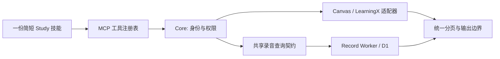

Hanyang Study 插件 QA 与简化建议 · 2026-09-07

这轮发现了会直接影响日常使用的错误：**已提交作业被报成未提交、历史录音拖垮整个列表、考勤列表和单项详情互相矛盾。** 现有测试和构建全部通过，不能据此认定插件可可靠地提醒作业、考勤和上课安排。

本轮没有修改业务代码、插件配置、数据库或生产部署，没有发送真实消息，也没有开始录音。新增文件仅在本 QA 目录；构建产生了项目正常的忽略产物。工作区开始时已存在大量未提交改动，审计期间也观察到依赖和 Record 文件继续变化，因此结论针对当时采样的工作区和线上版本，不代表已冻结的发布版本。

本轮证据：

| 检查 | 结果与范围 |
| --- | --- |
| 当前会话的 Hanyang 工具 | 33 个只读工具可见；send_message / reply_message 不在当前工具表 |
| 真实插件调用 | 29 种工具，共 36 次调用尝试；包含正常读取、交叉核对、空结果、权限拒绝、上游错误和参数拒绝 |
| 现有 Core 测试 | 14 个文件、114 项通过 |
| 现有 Record 测试 | 19 个文件、81 项通过 |
| 类型与构建 | Core / Record typecheck、Core build、Record build、Record sites:build 均通过 |
| 独立对抗探针 | 23 个场景：15 个违反预期不变量，8 个安全边界通过；失败场景之间有共同根因，不能算成 15 个独立线上事故 |
| 生产只读诊断 | 运行中的 Core 容器 healthy；在 Core 内检查录音响应的字段类型，确认历史模型名导致校验失败 |

[复现脚本](D:/Projects/Study/docs/qa/2026-09-07/repro.mts)只用合成上游响应和内存数据库，禁止真实网络依赖。[探针结果](D:/Projects/Study/docs/qa/2026-09-07/probe-results.json)保存每项预期失败。[线上采样摘要](D:/Projects/Study/docs/qa/2026-09-07/live-summary.json)不包含邮件全文、录音全文或凭据。

**1. P1：已经交了，周报还说没交。线上复现 + 本地复现 P01/P02。**

课程 `215729` 的作业 `2803267`：

| 来源 | 返回事实 |
| --- | --- |
| weekly_summary / get_upcoming_work | submissionStatus=unsubmitted，completed=false |
| list_assignments / get_assignment | submission.status=submitted |
| get_submission_status / list_course_submissions | submitted；提交时间 2026-09-06T06:44:13Z，attempt=1 |
| LearningX 周学习 | 对应作业 completed=true |

这会让她重复检查、重复做作业，并逐渐失去对提醒的信任。

[normalizeUpcomingWork](D:/Projects/Study/apps/core/src/canvas/client.ts:1283)把 Planner 的状态摘要交给 [submissionStatus](D:/Projects/Study/apps/core/src/canvas/client.ts:414)，后者只理解 Submission 的 workflow_state/submitted_at 等字段。Planner 采用另一份状态摘要契约；缺少 Submission 字段不能推导为“未提交”。[Canvas Planner 官方契约](https://developerdocs.instructure.com/services/canvas/resources/planner)还提供原生 incomplete_items 过滤。

建议：取消不加区分的状态归一化。Planner 负责发现事项；正式提交状态取 Submission，或者保留明确的 Planner 原始状态来源。无法判断必须是 unknown。完成过滤尽量交给上游，避免本地重新猜测“完成”的含义。不要让两套相似接口共用一个看起来简洁、实际丢失语义的函数。

**2. P1：一条历史录音让整批录音都打不开。线上确认根因 + 本地复现 P11。**

list_lecture_sessions(limit=5) 成功，limit=10 和 status=ready,limit=10 均报 invalid_response。最新一条录音全文可以正常读取；搜索也能命中已有录音，故不能告诉用户“没有录音”。

生产只读检查确认：前 10 条中前 8 条通过校验，第 9、10 条的 models.transcription 是 `gpt-4o-transcribe`；[消费者 schema](D:/Projects/Study/apps/core/src/lecture/types.ts:42)只接受 `gpt-realtime-whisper`。错误准确落在 models.transcription。整批数组解析使一个历史记录阻断其余健康记录。

建议：**创建录音的允许模型列表，与读取历史记录的格式约束分开。** 历史模型名属于元数据，用有长度限制的字符串即可；不要随每次换模型添加一个旧模型特判。Core 与 Record 共用公开录音契约。对于确实损坏的条目，返回明确的部分结果和错误定位，不能静默吞掉，也不应让与故障无关的记录全部失效。

**3. P1：考勤列表返回空，但视频单项实际存在且已完成。线上不一致已确认，原始响应根因未确认。**

同一课程 `215729`：list_learningx_attendance 返回成功的空数组；list_learningx_modules 返回两段考勤视频，均 completed=true；get_learningx_attendance_item(`1260902`) 返回 completed=true、progressSeconds=1443.34。单项读取本身可用。

代码存在两个已在合成场景复现的独立风险：

- [records()](D:/Projects/Study/apps/core/src/learningx/client.ts:58)遇到非数组直接变成空数组；P07 表明有内容的对象响应也会被悄悄变成“无记录”。尚未确认真实 allcomponents_db 是否正是此种格式。
- [findToolId](D:/Projects/Study/apps/core/src/learningx/client.ts:589)按标题正则取第一个匹配。P08 中，Offline Attendance 排在 Lecture/Attendance 前面时会选中前者。真实课程同时存在这两个入口；本次线上返回顺序并未证明实际误选了 Offline Attendance。

建议：先选定一条经验证的考勤枚举来源；如果周学习树能够稳定给出条目 ID，就用它枚举、单项接口补充进度，移除重复且不可靠的“全量考勤”路径。只有在确认两者覆盖范围一致后才能删除旧路径。入口选择使用当前课程 tabs 返回的 ID；多候选显式说明歧义。解析不符合契约应返回 invalid_response，不能伪装成空数据。不要继续增加中英韩标题正则。

**4. P2：列表没有可持续翻页的接口，数据越多越容易漏。本地复现 P03/P06/P10，代码确认。**

[getAllRecords](D:/Projects/Study/apps/core/src/canvas/client.ts:1405)内部会跟随分页，但达到 limit 就返回数组，不附带 nextCursor 或 hasMore。MCP 多数 Canvas 列表 limit 最大 200；[录音列表](D:/Projects/Study/apps/core/src/mcp/lectureTools.ts:36)最大 100，且没有日期窗口或游标。

直接影响：她找较早邮件、期初录音，不能靠“再往前找”持续翻页。搜索也不是替代方案，因为她可能只记得日期，或某条记录没有包含猜测的关键词。

另外两处顺序错误：

- P03：先取一条已完成事项达到 limit，再过滤已完成，返回空；第二页明明还有未完成作业。[getUpcomingWork](D:/Projects/Study/apps/core/src/canvas/client.ts:912)
- P06：先截取全局课程，再过滤用户指定课程，使目标课在下一页时消失。[weeklySummary](D:/Projects/Study/apps/core/src/canvas/client.ts:958)

建议：所有集合采用同一页结构：items、nextCursor、完整性说明、查询范围。过滤先于数量限制。Cursor 由服务端限定为安全的续读状态，不能允许任意 URL。删掉各处“截完再筛”的特殊逻辑，也不要靠把 limit 调得更大解决。

**5. P2：材料较多的模块被解释成空模块。本地复现 P04 + 官方契约确认。**

[normalizeModule](D:/Projects/Study/apps/core/src/canvas/client.ts:1097)把缺少 items 统一输出为 []，同时丢弃 items_count。Canvas 明确允许在内容多时省略内联 items，要求调用方再读 List Module Items；include[]=items 并不保证拿全。[Canvas Modules 官方契约](https://developerdocs.instructure.com/services/canvas/resources/modules)

建议：保留父模块元数据与子条目集合的边界。统一的分页读取器负责子条目；尚未读完就报告“不完整”。不要对某一门课、某一周或某个条目数量写例外。

**6. P2：周报承担了过多隐含承诺，同时缺少必要的信息。部分线上证据 + 本地复现 P05。**

[weeklySummary](D:/Projects/Study/apps/core/src/canvas/client.ts:958)将课程、Planner、日历和公告捆在一起；任何分支失败都会让整个工具失败。P05 中仅公告 403，正常课程和事项也无法返回。

真实本周结果 announcements=[]，但 Inbox 中 8 月 31 日的教师消息明确说 9 月 8 日起恢复教室上课并带教材。旧消息中的未来安排不属于“本周发布的公告”，而当前周报也不读 Inbox 或 LearningX。这并不代表公告 API 错误；它说明“这些集合的计数”不足以支撑“本周所有重要事项”的用户理解。

建议：逐步撤掉这层自定义业务聚合。保留可独立读取的事实，让模型按用户问题组合课程、事项、消息、学习内容；答案附本次查询覆盖范围。若兼容期保留 weekly_summary，只作为薄组合入口，返回各来源的独立成功/失败，不再维护另一套完成判断。已有技能或定时任务引用它时，必须先迁移调用方再删除工具。

**7. P2：本系统产生的 daily ID，被本系统的查询拒绝。线上与本地复现 P09。**

真实录音 courseId=daily，list_lecture_sessions(course_id="daily") 却被数字正则拒绝。搜索同样使用该限制。Record 明确保留 daily 作为唯一的本地课程。

建议：共用 CourseRef 契约，明确表达 Canvas 课程和 daily 两类有效引用。删掉 MCP 中另写的数字课程正则。安全校验应该确认“是不是允许的课程引用”，而不是把 Record 的领域强行缩成 Canvas 数字 ID。

**8. P2：一个标点就能把权限不足变成“登录失效”。本地复现 P15。**

[errorCodeForStatus](D:/Projects/Study/apps/core/src/canvas/client.ts:329)仅完整匹配两个中英文报错文本；合成响应只把“用户无权执行该操作”改成“用户无权执行该操作。”，诊断立即变为 authentication_failed。本场景先验证了 profile 成功。

本次真实文件列表的权限拒绝被正确识别；这不能证明相同错误换一种语言、标点或包装后仍然正确。

建议：去掉对人类文案的真假判断。优先保留结构化状态；401 无法确认原因时返回“访问被拒绝，原因未确定”。需要区分凭据失效与操作权限时，使用一次受控的连接检查，而不是不断扩充报错翻译表。不要直接引导用户反复重新授权。

**9. P2：两套正则 HTML 清洗和上游报错透传，突破了已宣称的输出边界。本地复现 P12/P13/P14。**

- 编码后的 jav&#x61;script URL 会保留在“已清洗 HTML”中。
- 作业 HTML 中的文件 verifier 链接原样进入结果，绕过了 get_file 专门设计的下载链接边界。
- 当合成的上游错误包含合成 PAT 文本时，[canvasErrorMessage](D:/Projects/Study/apps/core/src/canvas/client.ts:302)把它复制到公开 error.message。

本轮没有证明真实浏览器执行了 XSS，也没有发现真实 PAT 外泄；以上是明确可复现的输出边界缺陷，不能夸大为已发生的入侵。

建议：MCP 优先只输出结构化文本、来源 ID、经过统一处理的链接。使用一套基于 HTML 解析器的转换过程，提取可访问文件 ID并去掉能力凭据；如果确需 HTML，由成熟清洗器负责允许列表。公开错误使用固定安全文案、错误码和请求 ID，不透传任意上游文本。这样可删除 Canvas 与 LearningX 两份几乎相同的正则清洗函数，也不需要再写秘密关键词黑名单。

**10. P2：能力说明存在漂移，模型可能执行不到用户理解的能力。当前会话与源码核对。**

源码有两个消息工具、插件 manifest 宣称 Write，但本会话仅有 33 个只读工具。这里尚不能区分注册更新、会话工具快照、功能开关和授权范围的具体原因，不能把“重新授权”当作已验证的万能解法。

[Study 技能开头](D:/Projects/Study/plugins/canvas/skills/study/SKILL.md:8)允许遵循明确的发信请求，[末尾](D:/Projects/Study/plugins/canvas/skills/study/SKILL.md:32)又无条件禁止 post messages。这样的重复约束会让同一个请求被不同上下文解释出不同结果。

建议：工具注册表是能力、参数、权限和错误的唯一来源；技能只保留证据优先级、歧义处理、授权原则，不再重述整份 API 手册。发送能力仅在运行环境实际可用时宣称；验收应比较源码、安装包与真实 tools/list/会话工具表。不要增加第四份“覆盖旧说明”的指令。

**两项架构债，应纳入简化，但本轮不当成已发生的线上错误。**

1. [课表](D:/Projects/Study/apps/core/src/timetable.ts:45)是写死的 2026 秋季数据；[内部录音接口](D:/Projects/Study/apps/core/src/internal/http.ts:45)又另加一份教学周定义。当前数据与 7 门课对应，未证明本学期课表错误。建议改为单份导入数据，记录学期、来源、有效期；换学期不应改 TypeScript。临时通知仍以原文和明确日期为证据，不建设一套“网课/停课关键词识别引擎”。
2. Record 的 Express/SQLite 与 Worker/D1 各自维护路由、仓储和搜索。服务器搜索用 FTS，Worker 搜索用 LIKE，行为和测试入口不同。建议保留正式运行的 Worker/D1，本地用现有 sites:dev 运行同一路径；迁移本地开发调用方后删除重复 Express app 和 SQLite 仓储，保留共享的 OpenAI/课程访问纯模块。此处是减少漂移源的设计建议，未声称两套环境已被全面对比实测。

**建议的目标结构：保留明确的事实接口，缩减重复实现。**



| 动作 | 具体范围 | 为什么 |
| --- | --- | --- |
| 保留 | Core OAuth/账号绑定、服务器保存 PAT、来源 host 限制、只读边界 | 防止跨账号和凭据外流，属于必要复杂度 |
| 保留 | 消息 request_id 去重、unknown 不自动重发、独立 write scope | 避免重复真实发信；本轮只做模拟验证 |
| 保留 | 录音 writer lease / revision / finalizationWarning | 保护多设备和录音中断状态，不能为减少代码而删除 |
| 合并 | 公共事实 DTO、MCP 输入输出类型、页结构和错误结构 | 消除 daily、旧模型名、截断与空数据的契约分叉 |
| 合并 | 工具注册/权限元数据生成、文本和链接处理 | 减少三套 register 辅助函数及重复清洗逻辑 |
| 删除或迁出 | 自定义周报状态判断、错误文案识别、LTI 标题首匹配 | 这些代码在替上游和用户语境做未经证明的推断 |
| 迁移后删除 | Record 的第二套路由/仓储，以及重复 API 手册式技能说明 | 让开发、测试和生产指向相同实现 |
| 改为数据 | 当前学期课表与来源有效期 | 减少每学期发布代码的需求 |

不建议做一个可请求任意路径的通用 fetch 工具。应保留课程、作业、消息、录音等清晰的领域操作，统一它们的基础设施；“少写重复逻辑”不等于“把安全边界交给模型猜”。

建议按三个可验证阶段实施，当前仅是方案：

1. 先统一事实契约与状态来源，覆盖已提交作业、daily、旧模型、缺字段、部分结果。优先解除已确认的日常错误。
2. 统一集合分页、文本输出与安全错误；通过同一组通用不变量测试，然后迁移现有调用方。
3. 删除重复周报逻辑、重复 Record 后端和重复技能描述；最后核对安装包与实际可调用工具。保留旧域名/注册资源兼容，不能借简化之名顺带做 OAuth 或机构迁移。

**从她的使用方式出发的验收表。**

| 她的请求或遇到的情况 | 本轮证据 | 应有的验收结果 |
| --- | --- | --- |
| 我这个作业交了吗？ | 线上失败：周报与提交详情矛盾 | 所有回答以明确来源的提交状态一致回答 |
| 今天还有什么没做？ | P03；未来窗口也不代表历史欠交 | 查询范围明确，已完成过滤后仍可继续读取；欠交另查 |
| 明天在哪上课，要带什么？ | 真实旧 Inbox 包含本周安排，周报未覆盖 | 课表 + 同课程通知；保留原时间地点及临时变更日期 |
| 视频都看完了吗？ | 列表空，两个视频和单项已完成 | 枚举与详情可交叉核对；失败不能回答“没有视频” |
| 找最早的录音 / 上个月那封邮件 | P10 与无游标集合契约 | 可以翻页或按时间范围继续查询 |
| 找我不选课程录的内容 | 线上与 P09 | daily 输入与输出一致 |
| 换过录音模型，还能看旧内容吗？ | 线上与 P11 | 新旧历史记录均可读取，当前写入策略不污染历史读取 |
| 一门课的公告没权限 | P05 | 保留其他已读事实，清楚列出未覆盖来源 |
| 老师上传了一大堆材料 | P04 | 模块条目单独分页，不把未加载内容当作空 |
| 文件列表被课程禁用了 | 线上 permission_denied | 不宣称全部文件不可读；仅用其他已授权来源给出的 file ID |
| 查看未读消息 | 真实读取 + G04 + 现有测试 | GET 必须带 auto_mark_as_read=false |
| 帮我写个草稿 | 技能与发信边界审查 | 不发送；与明确要求“发送”区分 |
| 发送后超时 / 重复点击 | 现有测试 + G08 | 相同 request_id 不重复 POST；unknown 不自动换 ID 重发 |
| 授权失效 vs 某一功能没权限 | P15 与真实目录拒绝 | 不靠错误文案正则盲目让她反复重连 |
| 成绩还没出 | G06；真实 grades 请求上游 500 | null 不当 0；请求失败不当未出分 |
| 学校内容含恶意指令或链接 | 不可信内容标注检查、P12/P13/P14 | 只作数据；安全链接/文件读取边界统一 |
| 手机断网、锁屏、后台录音、多设备接管 | 仅现有状态机/仓储测试 | 仍需在真实手机做完整链路验收，本轮不宣称实测通过 |
| 登出后重连、跨设备 Passkey、连接失效 | 仅现有认证测试 | 仍需真实浏览器验收，本轮未替用户进行身份操作 |

尚未实调 get_file、get_page、get_learningx_board_post、list_discussion_entries：已抽样课程没有返回可用于这些调用的合法资源 ID，未猜测 ID。没有做真实教师发信、用户账号切换、音频上传或原始录音保存。只读成功与消息写入成功是独立验收项。

默认测试并未覆盖足够多的“上游真实格式 → 领域事实 → MCP 输出”跨层不变量。后续重点应是：分页结果完整性、同一事实跨接口一致、旧数据可读、未知状态不被改成否定、一处失败不抹去其他事实、凭据不进入输出。用这几类通用约束覆盖更多输入，比累积课程名、语言和关键词用例更有价值。

在仓库根目录运行复现：

```powershell
node --import ./apps/core/node_modules/tsx/dist/loader.mjs docs/qa/2026-09-07/repro.mts
```

当前脚本退出码 1 是预期结果：它报告现有实现违反的 15 个场景，不对业务代码做修复。8 个通过项覆盖 ID 路径注入、跨域分页、分页循环、Inbox 不标已读、倒置时间窗、缺失成绩、文件链接过期以及并发发信去重。

自动审批拒绝了进一步从生产数据库解密 Canvas PAT、读取上游原始状态的诊断，理由是凭据提取及原始学生数据风险。未绕过该拒绝。录音模型根因来自此前已允许的 Core 内部只读类型检查；考勤原始响应结构仍未确认。审计可以在这些明确标注的边界内交付，不需要为完成报告继续访问生产凭据。
